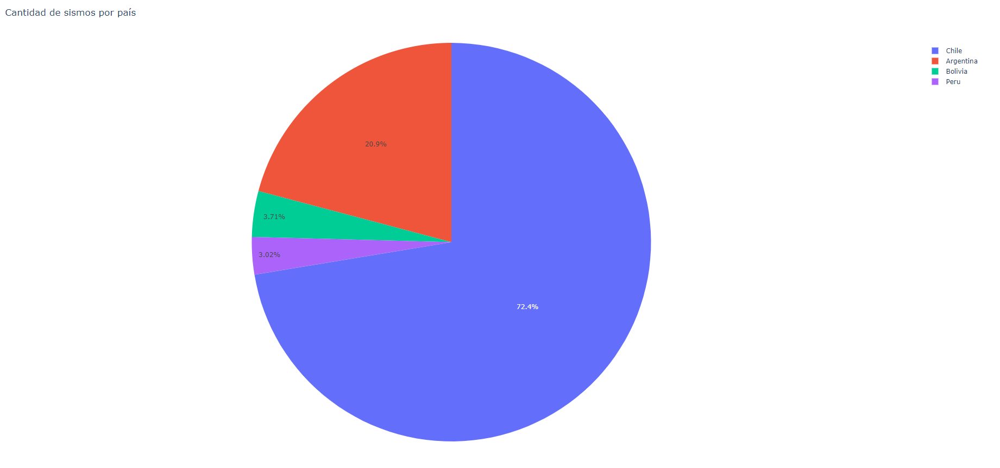
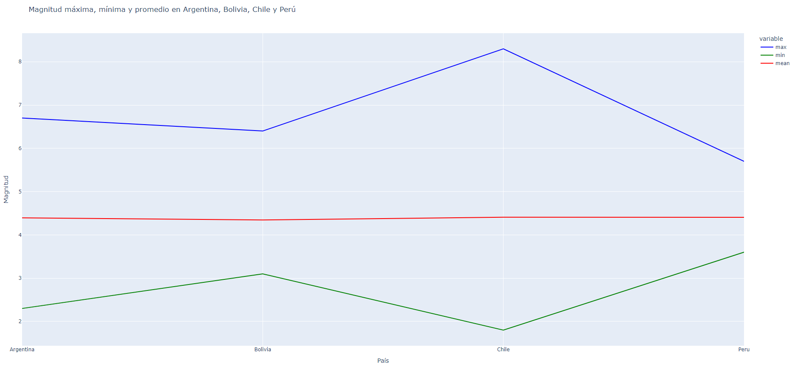
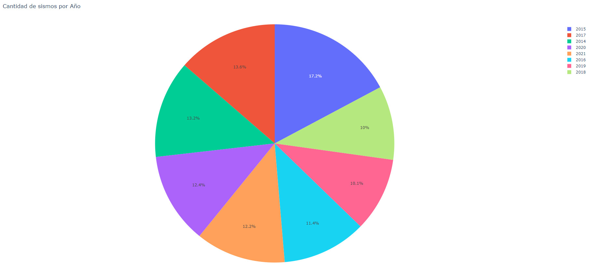
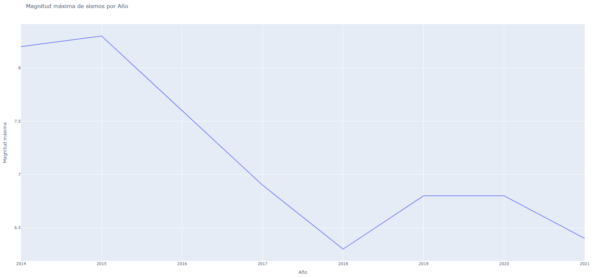
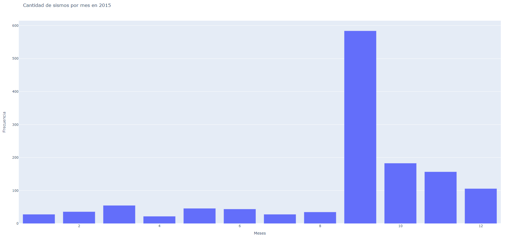
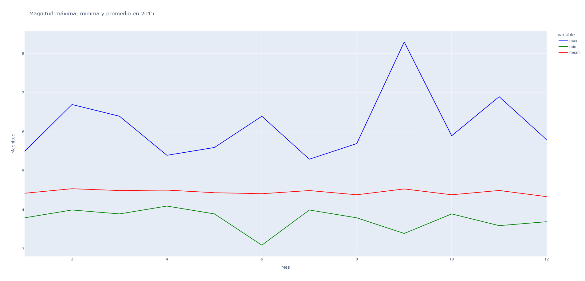

# Proyecto de Análisis de Datos - ETL y EDA para Sismos en Chile (2012-2022)

Este repositorio contiene un proceso ETL (Extract, Transform, Load) para analizar datos de sismos en Chile desde 2012 hasta 2022 obtenidos de un dataset de Kaggle. El objetivo de este proyecto es realizar una limpieza exhaustiva de los datos, transformarlos en un formato adecuado y cargarlos en tablas separadas para su posterior análisis en SQL Server Management Studio y PowerBI.


## Requisitos del Proyecto
* Python 3.11.1
* Visual Studio Code (VSCode)
* SQL Server Management Studio (para consultas SQL)
* PowerBI (para análisis visual)


## Instrucciones de Uso

1. Situate en el directorio donde vas a realizar el clone 
```bash 
cd ruta/de/directorio
```

2. Clona este repositorio
```bash 
git clone https://github.com/Crist1am/Chilean-earthquakes.git
```

3. Crea un entorno virtual 'myenv'
```bash 
    a. Si estas usando macOs, abre la terminal e ingresa

        python3 -m venv myenv


    b. Si estas usando Windows, ingresa en la terminal

        python -m venv myenv

```

3. Activa el entorno virtual
```bash 
    a. Usando macOS, escribe en la terminal:
        source myenv/bin/activate

    b. Usando Windows, escribe en la terminal:
        myenv\Scripts\activate

```

4. Instala las librerias necesarias desde la terminal
```bash
    pip install pandas
    pip install matplotlib
    pip install plotly
```

5. Ejecuta el archivo ETL.py para realizar el proceso ETL y generar las tablas CSV en el directorio /Dataset.

6. Ejecuta el archivo EDA.py para realizar un análisis de datos exploratorio con los datos limpios y ver el comportamiento de las variables.

7. Importa las tablas en SQL SMS y PowerBI según tus necesidades para realizar análisis detallados y visualizaciones interactivas.

8. Disfruta explorando y analizando los datos de sismos percibidos en Chile!.


## Contenido del Repositorio

1. sismos_chile_2012_2022.csv: Archivo CSV principal, contenido en la subcarpeta 'Dataset' que contiene datos brutos de sismos en Chile de 2012 a 2022.

2. ETL.py: Jupyter Notebook que contiene el código para el proceso ETL.

3. EDA.py: Análisis exploratorio de los datos finales de cada df.

4. /Dataset/:

        a. sismos_chile_limpio.csv: Archivo CSV con los datos limpios del df original, es decir, libre de valores nulos y con columnas ID.
    
        b. Fecha.csv: Tabla que contiene datos relacionados con las fechas de los sismos.
    
        c. Sismos.csv: Tabla que contiene detalles específicos de cada sismo.

        d. Ubicacion.csv: Tabla que contiene información sobre la ubicación geográfica de los sismos.

        e. Magnitud.csv: Tabla que contiene información sobre el tipo de magnitud de los sismos.


## Descripción del Proceso ETL

1. Extracción:

Mediante el metodo *os.getcwd()* se obtiene la ruta base del archivo 'NuevoProyecto' y se extraen datos del archivo sismos_chile_2012_2022.csv contenido en la carpeta Dataset

2. Transformación:

        a. Primero se escogen las columnas/variables a utilizar ('time', 'latitude', 'longitude', 'depth', 'mag', 'magType','dmin', 'place') del df original.

        b. Se eliminan las filas con valores nulos en alguna de sus columnas y se realiza una limpieza de datos.

        c. Se divide la columna 'place' en 'country' y 'city' para tener la posibilidad de agrupar por la ubicación más detallada y estandarizada.

        d. Creación de nueva columna llamada 'range' para, además de tener cada magnitud por separada, tenerlas categorizadas.

        e. Se transforma la columna 'dmin' a kilomtros ya que por defecto viene en grados y se tiene que 1° = 111.2 km

        f. Luego de separar la columna 'place' en 'city' y 'country' se generan nuevos nulos en columna 'city, por lo que se eliminan esas filas.

        g. Se transforma el formato de las columna 'date' a datetime ya que por defecto viene como 'object'. De esta manera se crean columnas 'day', 'month', 'year', 'hour' y 'minutes'

        h. Se ordena la columna 'date' del dato más antiguo al más nuevo y se ve que la base de datos comienza en agosto 2013, por lo que no es un año completo. Se opta por mantener solo los datos entre 2014 y 2021.

        i. Se añanden las columnas ID para generar vinculo entre las tablas que se generarán más adelante.

        j. Se crea nueva columna con el nombre de cada magnitud

        k. Se divide el df limpio en 4 nuevos df solo con las columnas correspondientes

3. Carga:

Como se mencionó, los datos transformados se dividen en cuatro tablas: 'Fecha', 'Sismos', 'Ubicacion' y 'Magnitud'. Estas tablas se guardan como archivos CSV en el directorio /Dataset.


## Descripción del EDA

Se llama cada archivo CSV limpio contenido en la carpeta 'Dataset' (Fecha.csv, Magnitud.csv, Sismos.csv y Ubicacion.csv) mediante un ciclo *for* y se renombran a conveniencia. 
Posterior a eso se realiza el primer *merge* con el fin de unir la tabla de fechas y sismos mediante la llave 'ID_Date', esto con el fin de graficar mediante plotly (para obtener gráficos interactivos) la magnitud más alta de los sismos percebidos en Chile en cada año de la base de datos. 

Se filtra el primer *merge*, creando uno nuevo (*merge_2*) para ver solo los datos correspondientes al año 2015 (ya que en ese año ocurrió el sismo de mayor magnitud) y con esto se grafica las magnitudes máximas, mínimas y promedio de cada mes del año 2015, obteniendo como dato principal que en septiembre de ese año fue el sismo más grande (magnitud de 8.3), así como en junio el más bajo (con una magnitud de 3.1). Con respecto a los promedios, se tiene que son similares (cercanos a 4.5), pese a este valor alto en el mes de septiembre, posiblemente por la cantidad de sismos que ocurren y el promedio tiende a disminuir. Segun esto, se agruparon los sismos por mes (durante el año 2015) y se corrobora lo mencionado, ya que segun el tercer gráfico, se tiene que en septiembre de 2015 hubo 584 sismos que fueron percibidos en Chile (pudiendo tener epicentro en Argentina, Bolivia, Perú o Chile), seguido muy de lejos por el mes de octubre con solo 184 sismos, por lo que esta alta cantidad de sismos en septiembre pudo haber hecho que el promedio mensual haya disminuido. Finalmente, el segundo gráfico con este *merge* creado, muestra la cantidad de sismos percibidos en Chile durante todos los años que comprende la base, obteniendo que precisamente el año 2015, fue el año donde más sismos ocurrieron.

Se realizó un tercer *merge* uniendo el df_fecha con df_sismos (mendiante la llave 'ID_Place') y se agruparon los datos segun el país, obteniendo datos como la frecuenta, máximo, mínimo y promedio con el fin de obtener 2 gráficos:
* La cantidad de sismos percibidos en Chile por país (Sabiendo que Chile es quien se llevaría el mayor porcentaje, sin embargo es interesante donde ocurren en su mayororía los sismos con epicentro fuera de Chile).
* Comparar las magnitudes máximas, mínimas y promedio entre todos los paises.

Como resultado del primer gráfico del tercer *merge* se tiene que Chile tuvo 5577 sismos entre los años 2014 y 2021, seguido por Argentina, la cual tuvo 1608 sismos que fueron percibidos en Chile, por le contrario, los sismos con epicentro en Perú son los que menos se perciben en Chile. Y finalemente, el segundo gráfico realizado con este *merge* muestra que (probablemente debido a la cantidad de datos), Chile es quien tiene el sismo de mayor y menor magnitud (8.3 y 1.8 respectivamente) y con respecto al promedio, todos bordean el 4.4.


## Galería de imagenes 













## Uso de las Tablas en SQL SMS y PowerBI
* Las tablas 'Fecha', 'Sismos', 'Ubicacion' y 'Magnitud' se pueden importar en SQL Server Management Studio para realizar consultas y análisis detallados de los datos. Se pueden linkear mediante las columnas ID en cada una de ellas. 

* También se pueden cargar estas tablas en PowerBI para crear visualizaciones interactivas y realizar un análisis visual profundo.


### Ejemplo de Consultas SQL

```bash
-- Consulta para encontrar las ciudades con mayor cantidad de sismos:

    SELECT Ubicacion, COUNT(*) AS Cantidad_Sismos
    FROM Sismos
    GROUP BY Ubicacion
    ORDER BY Cantidad_Sismos DESC;

-- Consulta para encontrar la magnitud promedio por mes 

    SELECT F.month AS Mes, 
    AVG(S.mag) AS Magnitud_Promedio
    FROM Fecha AS F
    JOIN Sismos AS S ON F.ID_Date = S.ID_Date
    GROUP BY MONTH(F.Mes)
    ORDER BY Mes;

```
